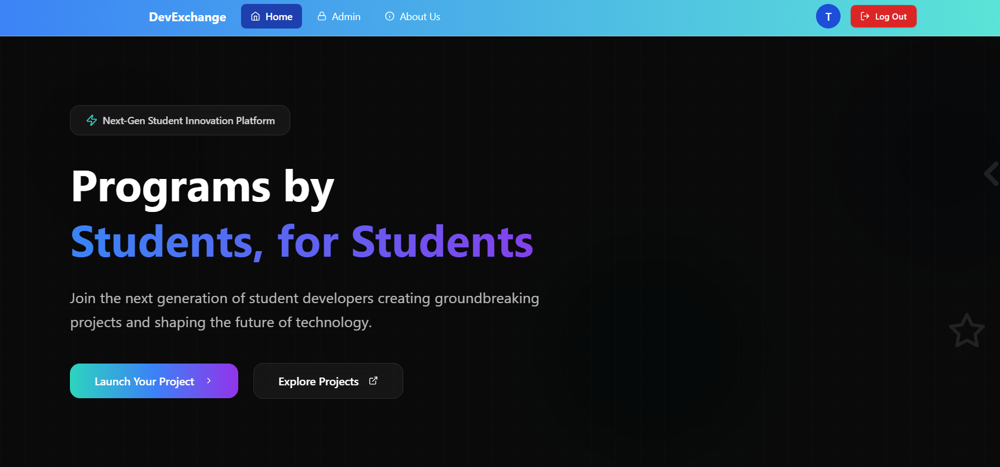
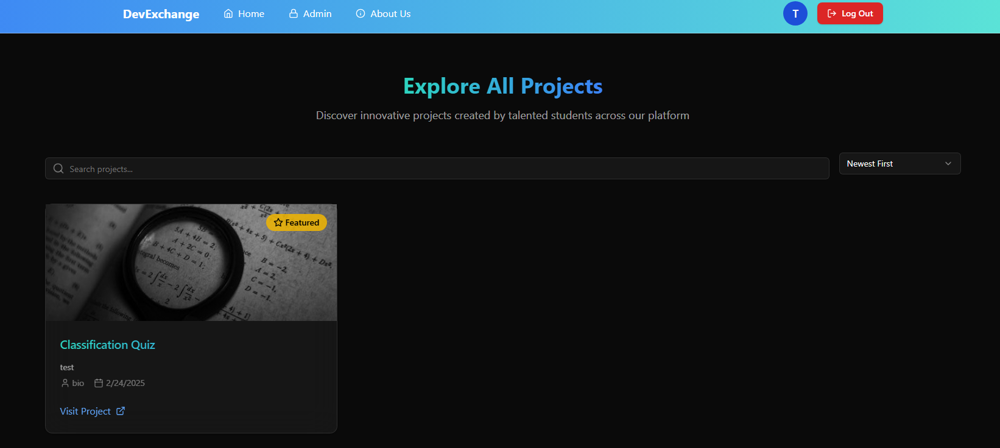
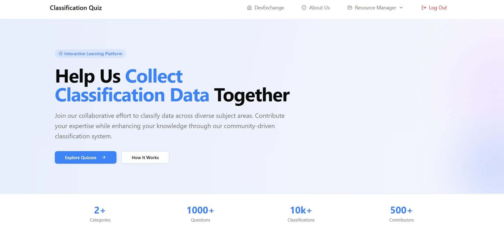
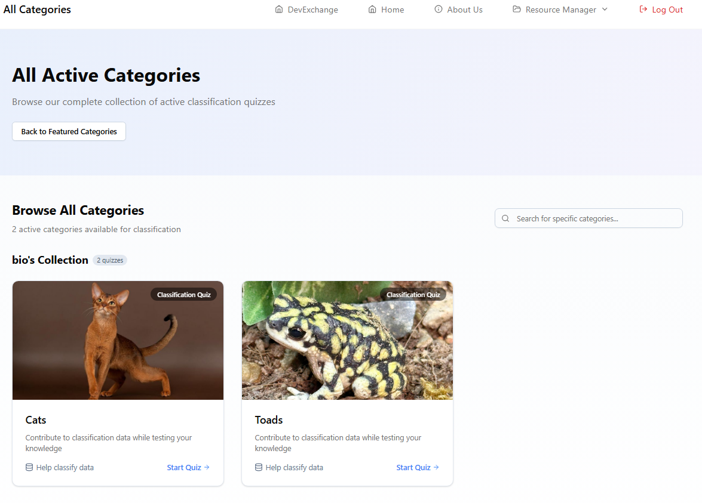
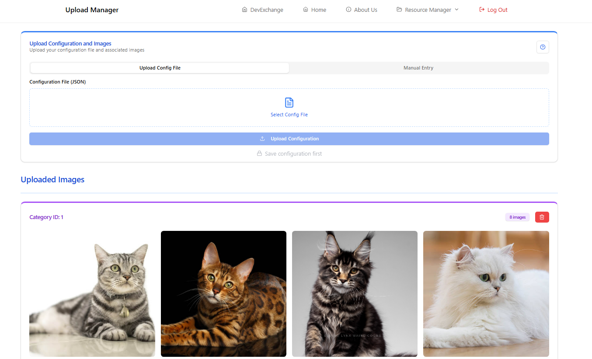
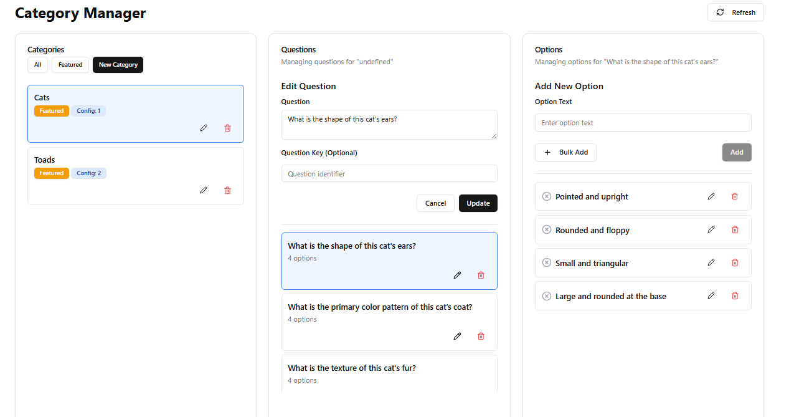
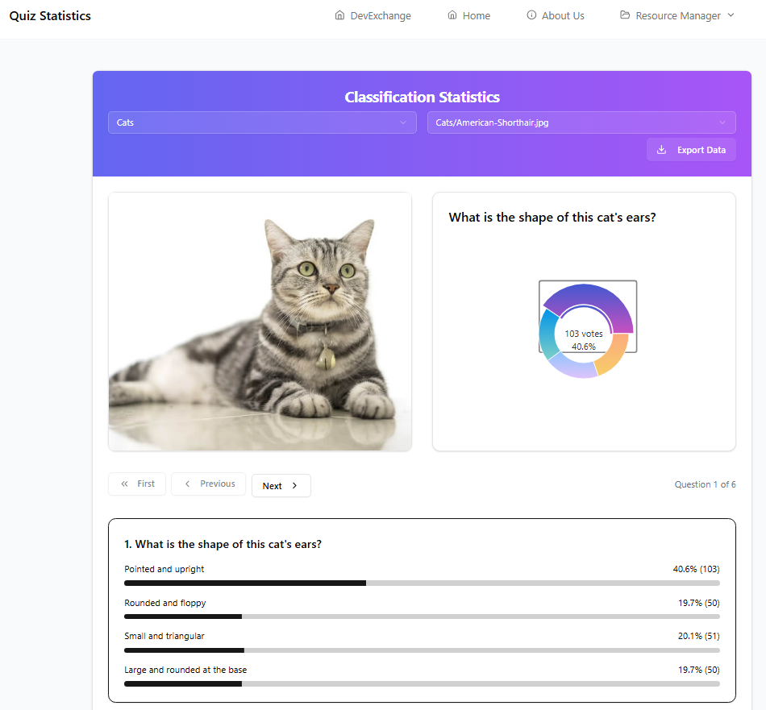
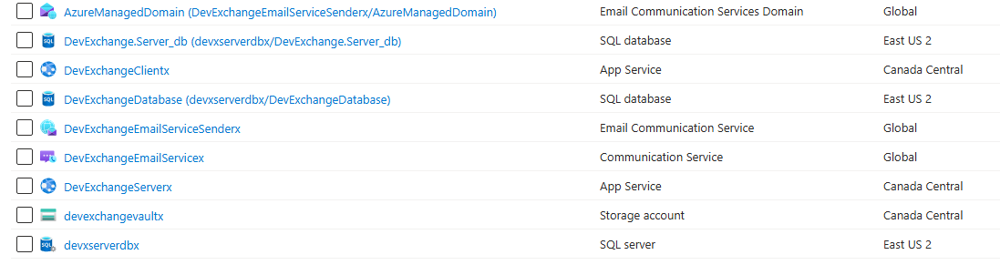

# Dev-Exchange Showcase (Software Engineering Internship Project)

This is a showcase repository for the project I completed during my Software Engineering internship. There are several branches in this repository to demonstrate my skills in various aspects of this project and software engineering in general:

- A **production branch** with a CI/CD pipeline workflow for deploying new changes to the hosted application on Azure
- A **local Docker branch** that I created and used to aid in development across platforms and different computer setups
- A **submodule** that showcases automated creation and deployment of the Azure resources used to host this project on Azure Web Services

## Project Description

I was tasked with independently developing a web application to be hosted on Microsoft Azure. I was granted full creative freedom to conceptualize and build a meaningful project that showcased the capabilities of Azure infrastructure.

I created a web platform for students and prospective students to showcase their programming projects and technical skills. Within this platform, I developed an interactive example application where students, professors, or researchers can upload images and create quiz-based classification tasks. For instance, a biology professor could upload frog images and ask users to classify traits—providing a fun, engaging way to crowdsource data for machine learning or academic research.

The core goal of the project was to serve as a boilerplate for future student developers. By deploying it on a structured Azure setup, I created a reusable infrastructure that incoming students can use to build and host their own applications—without needing to set up their own cloud environment from scratch.

## Key Accomplishments

This project demonstrated my ability to:
- Work independently across the full stack (frontend, backend, and cloud deployment)
- Leverage Microsoft Azure for scalable, cloud-based application hosting
- Build reusable infrastructure for others to extend and innovate on
- Translate educational and research needs into effective technical solutions

## Project Screenshots

### DevExchange Platform

### Classification Project

### Infrastructure
